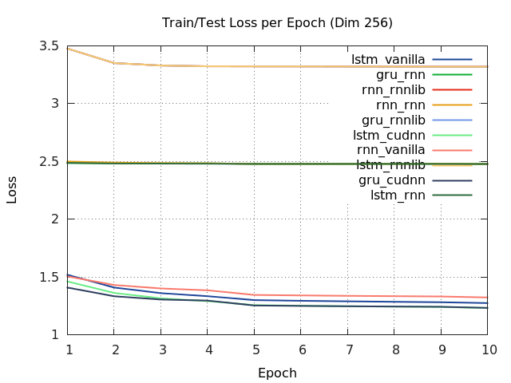
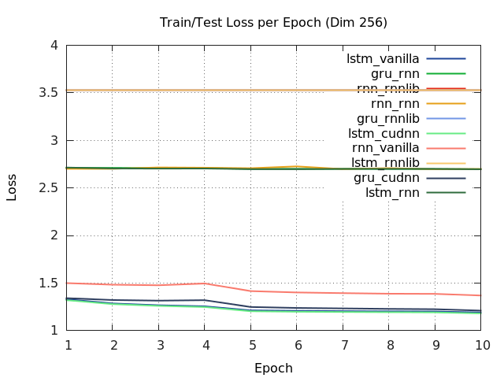
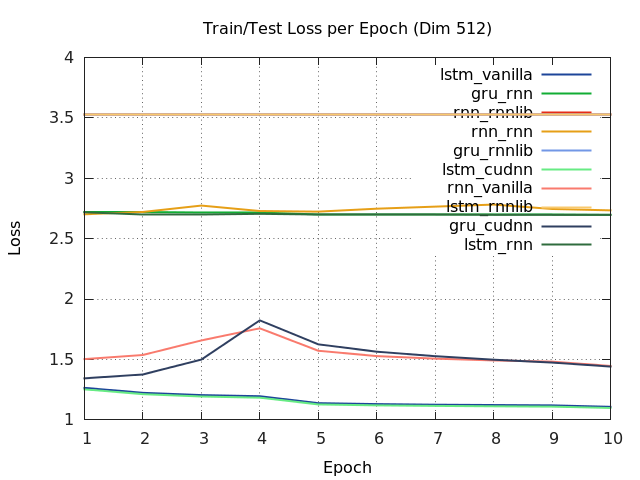

# RNN modules/libraries benchmark on Torch7

This repo contains benchmark results for popular rnn modules/architectures on three different libraries available for Torch7 on a simple task for word language model:

- [cudnn](https://github.com/soumith/cudnn.torch)
- [rnn](https://github.com/Element-Research/rnn)
- [rnnlib](https://github.com/facebookresearch/torch-rnnlib)

The evaluated rnn architectures are the following:

- RNN
- LSTM
- GRU

## Requirements

To use this repository you must have [Torch7](http://torch.ch/) installed on your system.
Also, you'll need a NVIDIA GPU with compute capability 3.5+ (2GB+ ram) and `CUDNN R5+` installed in order to run this code.

Furthermore, you'll need to install the following dependencies for torch7:

```bash
luarocks install cudnn
luarocks install optnet
luarocks install rnn
luarocks install rnnlib
luarocks install torchnet
```

> Note: Please make sure you have an up-to-date version of torch7 before running the benchmark script. To do this, go to your `torch/` folder and run the `./update.sh` file.


## Getting started

### Data setup

Download and setup the necessary data by running the following script:

```
th download_setup_data.lua
```

This script will download and extract the following datasets to disk:

- [shakespear](http://cs.stanford.edu/people/karpathy/char-rnn/shakespeare_input.txt)
- [linux kernel](http://cs.stanford.edu/people/karpathy/char-rnn/linux_input.txt)
- [wikipedia](http://prize.hutter1.net/)


### Benchmarking the networks/libraries

To evaluate the different rnn modules/libraries tested here, run the main script:

```
th scripts/run_benchmark.lua
```

This will train and test several networks on three different datasets and plot all results into sveral graphs for each dataset.


### Results

When running the benchmark script, you should get the same results presented in these next graphs.

All models have a sequence length of 50, a batch size of 64, 2 layers, and were averaged over 10 epochs and over all 3 datasets.

> Warning: Results are currently being processed. Once they are finished (it takes several days!) I'll upload them.

#### Speed (batch/ms)


#### Forward/backward Speed (batch/ms)


#### GPU Memory Usage (in MB)


#### Test Loss Results

Below are the results of the loss of all rnn
models tested on the Shakespear,
 Linux kernel and Wikipedia datasets.

| Shakespear | Linux kernel | Wikipedia |
| --- | --- | --- |
|  |  |  |
|  |  |  |
|  |  |  |
|  |  |  |
|  |  |  |


## License

MIT license (see the LICENSE file)
